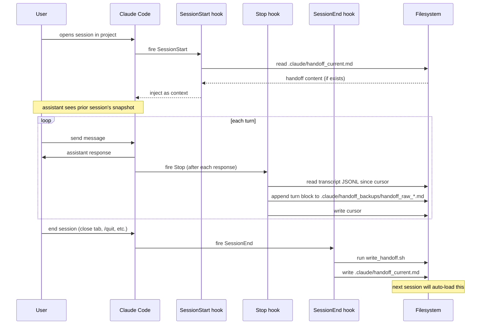
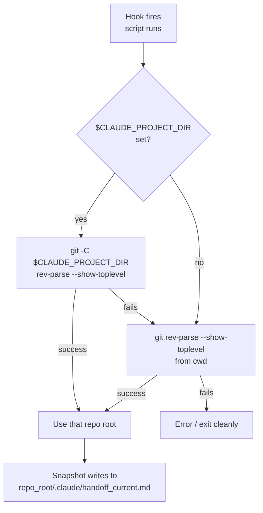
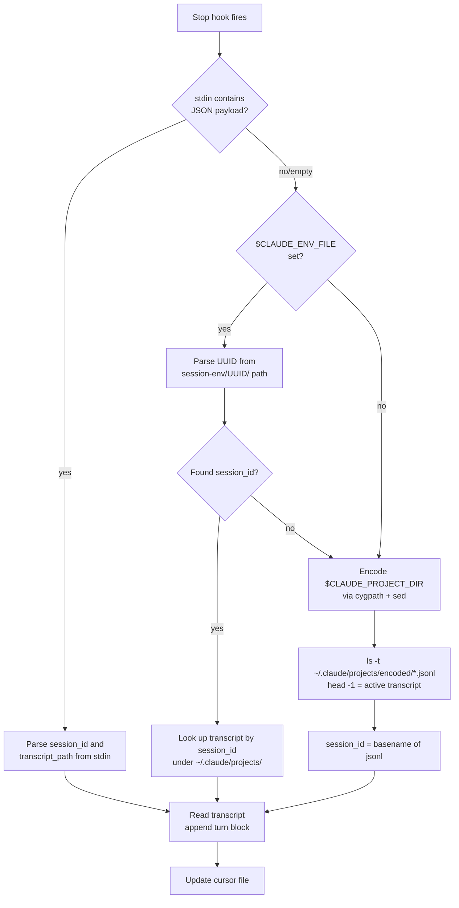
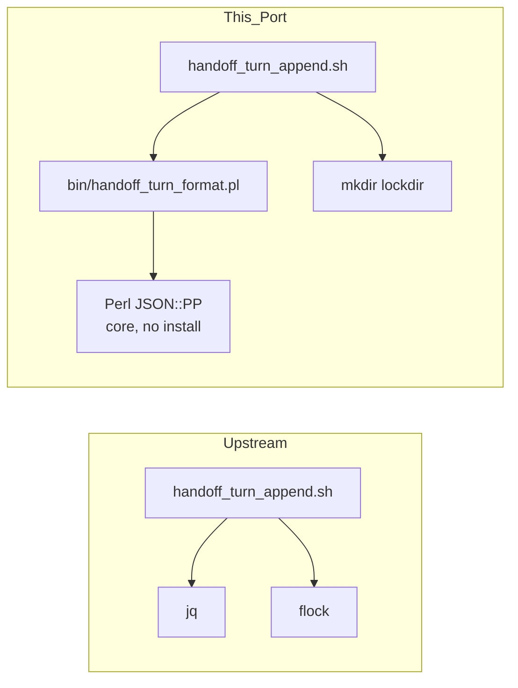

# Architecture

> Snapshot logic and `/handoff` skill spec are by Christopher Chadwick (upstream: [Sting25/claude-code-handoff](https://github.com/Sting25/claude-code-handoff)). This document describes the **port-specific architecture** — plugin manifests, hook wiring, fallback chains, and the cwd-resolution decision tree. For the *logic* of what gets snapshotted, see upstream.

---

## Repo layout

```
claude-code-handoff-cowork/
├── .claude-plugin/
│   └── marketplace.json          # Marketplace manifest (single-plugin marketplace)
├── cowork-plugin/                # The plugin itself
│   ├── .claude-plugin/
│   │   └── plugin.json           # Plugin manifest
│   ├── hooks/
│   │   └── hooks.json            # Declarative hook wiring
│   ├── bin/
│   │   ├── write_handoff.sh      # Snapshot script (upstream, slight edits)
│   │   ├── handoff_turn_append.sh # Stop-hook appender (upstream + port shims)
│   │   ├── handoff_turn_format.pl # Perl jq-replacement (port-specific)
│   │   └── probe_hook.sh         # Diagnostic env logger (port-specific)
│   ├── skills/
│   │   └── handoff/
│   │       └── SKILL.md          # /handoff skill (upstream, paths adapted)
│   └── README.md                 # Plugin-level docs
├── docs/
│   ├── VERIFICATION.md           # Test receipts
│   └── index.html                # Landing page (GitHub Pages)
├── LICENSE                       # Upstream MIT, preserved verbatim
├── CREDITS.md                    # Per-file attribution
├── CHANGELOG.md
├── CONTRIBUTING.md
├── USER-MANUAL.md
├── ARCHITECTURE.md               # this file
└── README.md
```

---

## Hook lifecycle

The plugin wires three hooks into Claude Code's session lifecycle. They fire in this order:



All three hook commands run with these env vars set by Claude Code:

- `CLAUDE_PLUGIN_ROOT` — absolute path to this plugin's install location (i.e. `~/.claude/plugins/marketplaces/claude-code-handoff-cowork/cowork-plugin`).
- `CLAUDE_PROJECT_DIR` — absolute path to the launch cwd. Per testing on this machine, this resolves correctly even when the shell's actual cwd is somewhere else (e.g. Cowork's `.klodock` sandbox dir).
- `CLAUDE_PLUGIN_DATA` — per-plugin data dir (unused by this plugin currently).
- `CLAUDE_CODE_ENTRYPOINT` — e.g. `claude-desktop` for sessions inside the Cowork app.

`hooks/hooks.json` references `${CLAUDE_PLUGIN_ROOT}/bin/...` for portable script paths.

---

## Repo resolution decision tree

The two bin scripts both need to know "what's the user's project?" The pwd-based approach upstream uses doesn't work in the Cowork app, because the Cowork app's Code-tab sessions root the shell at `C:\Users\scott\.klodock` (a Cowork sandbox dir), not the user's project.

Both scripts implement this resolution chain:



Why this matters:
- **Standalone Claude Code CLI** (Linux/macOS terminal): user launches `claude` from inside their repo. cwd is the repo. `CLAUDE_PROJECT_DIR` is also the repo. Both paths agree.
- **Cowork app Code tab**: shell cwd is `.klodock`. But `CLAUDE_PROJECT_DIR` is set to the project folder the user picked. The script uses `CLAUDE_PROJECT_DIR` and writes to the right place.
- **Edge case**: `CLAUDE_PROJECT_DIR` points at a non-git dir → fall back to pwd → if that's also non-git, error out cleanly.

---

## Stop-hook session info fallback

The Stop hook needs to know **which session fired** and **where the transcript JSONL lives** so it can read the new lines since the previous Stop. Upstream's contract (from Claude Code's documented hook API): a JSON payload `{"session_id": "...", "transcript_path": "..."}` arrives on stdin.

That contract works in **interactive** Claude Code. It doesn't always work in headless `claude -p` mode (verified on this machine: `stdin_bytes=0` for Stop events).

The plugin's fallback chain:



`CLAUDE_ENV_FILE` is set during `SessionStart` (its path contains the session UUID) but NOT during `Stop` or `SessionEnd` — verified by the probe. So in practice the third tier (filesystem search via encoded `CLAUDE_PROJECT_DIR`) is what carries headless mode.

The encoding scheme `~/.claude/projects/<encoded>/`: Claude Code converts a Windows path like `C:\Users\foo\bar` to `C--Users-foo-bar` by replacing `[:\/]` with `-`. The script uses `cygpath -w` first to handle MSYS form (`/c/Users/...`), then `sed`.

---

## Why this port replaces `jq` and `flock`

Both are present on Linux and macOS. Both are **missing on MSYS Git Bash on Windows**, which is the shell that runs hook commands inside the Cowork app's Code tab.

Upstream uses:
- `jq` to parse the transcript JSONL line-by-line.
- `flock -n` to serialize concurrent Stop-hook fires against the same dump file.

This port replaces them with:
- `bin/handoff_turn_format.pl` — a Perl helper using only `JSON::PP` (a core module since 5.14). Same per-line parse, same output shape.
- `mkdir <lockdir>` — atomic on every filesystem. `mkdir` succeeds for exactly one caller; concurrent callers see `EEXIST`. The script `trap`s `rmdir` on exit.



Both port-specific replacements were tested end-to-end:
- Perl helper produced 392 lines of formatted markdown from a 280-line real transcript with 0 stderr.
- `mkdir`-lock correctly serializes (verified: first fire wrote dump, second fire on unchanged transcript correctly no-op'd, no leftover lock dir).

---

## probe_hook.sh — diagnostic logger

`hooks/hooks.json` wires `bin/probe_hook.sh <event-name>` ahead of every real hook command. The probe writes one entry per hook fire to `~/handoff_probe.log` with:

- Timestamp and event name.
- pwd, `CLAUDE_PROJECT_DIR`, `CLAUDE_PLUGIN_ROOT`, `CLAUDE_CODE_ENTRYPOINT`, `CLAUDE_CODE_IS_COWORK`, `HOME`.
- `git rev-parse --show-toplevel` from both pwd and `CLAUDE_PROJECT_DIR`.
- For Stop/SessionEnd: stdin payload size + first 200 chars.
- All `CLAUDE_*`, `SESSION*`, `TRANSCRIPT*`, `HOOK*` env vars.

This is the troubleshooting bedrock. When something doesn't work, `cat ~/handoff_probe.log` shows:
- Whether the hook fired at all.
- What env it saw.
- Whether the project resolution found a valid git repo.

Cheap, low-overhead (single `tee`-style branch in each hook command), and silent in normal operation.

---

## File outputs

Two files per repo:

### `<repo>/.claude/handoff_current.md`

Written by `bin/write_handoff.sh`. Overwritten each call. Lives in the user's project. Format (upstream's design):

```
# <reponame> — session handoff (auto-generated)

**Generated:** YYYY-MM-DD HH:MM UTC

[boilerplate]

---

## Repo: <reponame>

**HEAD:** `<short_sha>` — <subject>
**Branch:** `<branch>` (<upstream_status>)

### Recent commits
```
<git log --oneline -10>
```

### Working tree
[clean / git status -s output]

## In-flight (untracked or modified .md under `<dir>/`)
[list of .md files]

## Verify state matches reality
[bash commands]

---

## Notes from this session

[placeholder — /handoff fills this in via Edit; SessionEnd leaves it as placeholder]
```

Gitignored (auto-bootstrap unless `HANDOFF_NO_GITIGNORE_BOOTSTRAP=1`).

### `<repo>/.claude/handoff_backups/handoff_raw_<session_id>.md`

Written incrementally by `bin/handoff_turn_append.sh` after every assistant turn. Pruned to 3 newest per repo. Format (upstream's design):

```
# Raw session dump

**Session ID:** `<UUID>`
**Started:** YYYY-MM-DD HH:MM UTC

[boilerplate]
---

## Turn at YYYY-MM-DD HH:MM:SS UTC

**User:**
<user message, noise tags stripped>

**Assistant:**
<assistant text>

**Tool calls:**
- `<tool_name>` — <input truncated to 300 chars>

## Turn at ...
...
```

Gitignored too.

---

## Manifest formats

### Marketplace manifest (`.claude-plugin/marketplace.json`)

Top-level structure (validated by `claude plugin validate`):

```json
{
  "name": "claude-code-handoff-cowork",
  "owner": { "name": "...", "email": "..." },
  "metadata": { "description": "...", "version": "...", "homepage": "...", "repository": "..." },
  "plugins": [
    {
      "name": "claude-code-handoff",
      "description": "...",
      "version": "0.1.0",
      "source": "./cowork-plugin",
      "author": { "name": "...", "email": "..." },
      "license": "MIT",
      "homepage": "...",
      "keywords": [...]
    }
  ]
}
```

The `plugins[].source: "./cowork-plugin"` field is what makes this a "single-plugin marketplace" — the marketplace lives at repo root but the plugin lives in a subdirectory.

### Plugin manifest (`cowork-plugin/.claude-plugin/plugin.json`)

```json
{
  "name": "claude-code-handoff",
  "version": "0.1.0",
  "description": "...",
  "author": { "name": "...", "email": "..." },
  "homepage": "...",
  "repository": "...",
  "license": "MIT",
  "keywords": [...]
}
```

**Gotcha discovered during development**: the schema does NOT allow a `contributors` field (validation errors with `Unrecognized key: "contributors"`). Upstream attribution is in the `description` prose and in `CREDITS.md` instead.

---

## What this port is NOT

- It's not a fork of upstream's runtime code. The snapshot logic is upstream's. The skill spec is upstream's. We packaged it and shimmed two missing deps. Big difference.
- It's not a marketplace of multiple plugins. It's a single-plugin marketplace — one repo, one plugin.
- It doesn't ship its own Claude Code or Cowork binaries. It loads alongside whatever's already installed.
- It doesn't try to fix Anthropic's hooks-in-Cowork-VM bug (#27398/#40495). That's an Anthropic-side fix.

---

## See also

- [USER-MANUAL.md](USER-MANUAL.md) — install, daily use, troubleshooting.
- [CHANGELOG.md](CHANGELOG.md) — what shipped when.
- [CREDITS.md](CREDITS.md) — per-file attribution.
- [docs/VERIFICATION.md](docs/VERIFICATION.md) — end-to-end test receipts.
- [Sting25/claude-code-handoff](https://github.com/Sting25/claude-code-handoff) — upstream.
